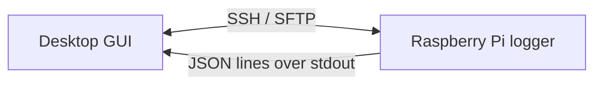

# SensePi Local Recording & Live View

This repository hosts a desktop application for managing Raspberry Pi–based sensor loggers alongside the scripts that run directly on the Pi. The PC/WSL side provides a PySide6 GUI for recording, live viewing, and analyzing data, while the Pi side supplies lightweight logger scripts for specific sensors. The desktop app focuses on inspecting logs from the MPU6050 logger.

## Architecture & Roles

- **Desktop GUI (PC/WSL)**
  - Starts/stops Pi loggers over SSH and synchronizes files over SFTP
  - Displays live time-domain and FFT plots
  - Pushes sensor defaults from `src/sensepi/config/sensors.yaml` into each Pi’s `pi_config.yaml`
  - Downloads recent CSV/JSONL logs for offline browsing
- **Raspberry Pi logger**
  - Runs the `raspberrypi_scripts/` CSV/JSONL logging scripts on the device
  - Streams JSON lines over stdout to the desktop (protocol: `docs/json_protocol.md`)



The JSON streaming format and field definitions are documented in `docs/json_protocol.md`.

Configuration files live with the GUI under `src/sensepi/config/hosts.yaml` and `src/sensepi/config/sensors.yaml`, while each Pi keeps its active settings in `raspberrypi_scripts/pi_config.yaml`; the GUI’s Sync action pushes the desktop sensor defaults to that Pi file so every logger shares the same baseline.

## Decimation & Plotting Configuration

Low-latency recording, streaming, and visualization all pull their settings from the `SensePiConfig` dataclass (`src/sensepi/config/runtime.py`).  Load it from YAML via `sensepi.config.load_config`, tweak the fields you care about, then pass it to `sensepi.core.pipeline_wiring.build_pipeline` (for the recorder/streamer/plotter fan-out) and `LivePlot.from_config` (for Matplotlib demos such as `run_live_plot.py`).  Adjusting the config object once at startup keeps rasterizer, streamer, and recorder behaviour in sync without editing multiple modules.

Recommended starting points for human-friendly refresh rates:

- `plot_fs ≈ 50 Hz` keeps the Matplotlib view smooth on Pi Zero 2 while keeping the decimator ratio large enough for 500–1000 Hz sensors.
- `smoothing_alpha ≈ 0.2` corresponds to ~20–50 ms of IIR smoothing—large enough to calm jitter but small enough to keep spikes visible.
- `plot_window_seconds ≈ 5–10 s` balances temporal context and responsivity for the scrolling plot.
- `spike_threshold ≈ 3×` the noise standard deviation works well for highlighting interesting transients without littering the plot with markers.

Create a YAML file with the fields you need (unknown keys are ignored) and point the demo at it:

```yaml
pipeline:
  sensor_fs: 1000.0
  stream_fs: 40.0
  plot_fs: 48.0
  plot_window_seconds: 8.0
  smoothing_alpha: 0.2
  spike_threshold: 0.6
```

```bash
python run_live_plot.py --config configs/pipeline.yaml
```

`run_live_plot.py` also exposes `--plot-window`, `--spike-threshold`, and `--plot-fs` flags for quick experiments without editing the YAML file.

## Project layout

```
sense-pi-local-recording-live/
├── main.py              # Thin launcher that delegates to sensepi.gui.application
├── src/sensepi/tools/   # Local plotting helpers and CLI plotter
├── pyproject.toml       # packaging metadata
├── requirements.txt     # desktop dependencies
├── requirements-pi.txt  # Pi dependencies
├── src/sensepi/         # desktop application package
├── raspberrypi_scripts/ # files copied to the Raspberry Pi
├── data/                # raw and processed data (ignored)
├── logs/                # application logs (ignored)
└── archive/             # legacy and experimental files
```

## Run the GUI

From the project root you can launch the Qt application via the canonical
entrypoint:

```bash
python -m sensepi.gui.application
# or, after installing the package:
sensepi-gui
```

`main.py` simply delegates to the same launcher so either form works. The
tabbed interface exposes Recorder, Signals, FFT, Offline, and Settings tabs.
Configuration defaults live under `src/sensepi/config/` and can be customised
per host and sensor.

### SSH authentication

The desktop app connects to each Raspberry Pi using a username and password.
Populate `src/sensepi/config/hosts.yaml` (or the Settings tab) with the host,
port, username, and password for each Pi. SSH key authentication and agent
forwarding are not supported in this version.

## Configuration paths

By default the GUI stores output under `data/` and `logs/` inside the project
root. Set `SENSEPI_DATA_ROOT` or `SENSEPI_LOG_DIR` (they both understand `~`)
before launching the app to relocate those folders for packaged installs or
custom deployments. The paths shown in `src/sensepi/config/hosts.yaml` and
`raspberrypi_scripts/pi_config.yaml` are only examples—update them to match
each Pi’s filesystem layout.

## Sync config to Pi

The Settings tab offers a **Sync config to Pi** action. It builds a
`pi_config.yaml` from the desktop sensor defaults, validates that the remote
scripts/data directories exist over SSH, and uploads the YAML to the path
configured for the selected host. The desktop configuration is the source of
truth; use this button to push updates to your Pis.

## Plotting from CSV logs

The Matplotlib-based CLI plotter lives at `src/sensepi/tools/plotter.py`. Run
it directly or import its helpers for embedding in Qt tabs:

```bash
python -m sensepi.tools.plotter --file data/raw/your_log.csv
```

An offline analysis tab in the GUI reuses the same plotting logic to view
recent CSV/JSONL logs without starting a live stream.

## Raspberry Pi scripts

The `raspberrypi_scripts/` folder contains the low-level loggers that run on the Pi. Copy the folder to your device (e.g., `/home/pi/raspberrypi_scripts`) and install dependencies:

```bash
scp -r raspberrypi_scripts pi@<host>:/home/pi/
ssh pi@<host> "bash /home/pi/raspberrypi_scripts/install_pi_deps.sh"
```

Use `run_all_sensors.sh` as a simple helper to start the provided logger scripts. Adjust `pi_config.yaml` to set sample rates, output paths, and channel selections.

The streaming JSON wire protocol used by the loggers is documented in
`docs/json_protocol.md`.

## Legacy content

The `archive/` directory is reserved for older or experimental scripts that
you don’t want to delete yet. You can move legacy entrypoints or prototypes
there to keep the main code paths focused on the current PySide6-based
workflow.
